# Link-Failure-Detection-and-Recovery
 
<div align="center">
        


 
**An SDN-based solution using Mininet and Ryu to detect link failures in real time  
and automatically reroute traffic — zero human intervention, zero dropped pings.**

---
 
</div>
 
## ⚡ How It Works in 30 Seconds
 
- **Ryu controller** connects to all three switches via OpenFlow 1.3 at startup and pre-installs explicit L3 flow rules for both directions of traffic
- **Primary path** (`h1 → s1 → s2 → h2`) is installed at priority 10 on all switches
- When `s1-s2` goes down, OVS fires an **`OFPPortStatus`** event to the controller — no polling, no timers, purely event-driven
- The controller **deletes all existing flow rules** across all switches and **pushes backup rules at priority 20** routing traffic through `s3`
- When the link recovers, the same event triggers a **switchback to primary** — the whole cycle completes before a single ping times out
- ARP is always flooded (priority 5) so address resolution never breaks during path switches
---
 
## 🌐 Network Topology
 
```
    h1 (10.0.0.1)
        |
        s1
       /  \
      /    \        
    s3      s2 
      \    /
       \  /
         |             Primary path: h1 ──► s1 ──► s2 ──► h2
    h2 (10.0.0.2)      Backup path:  h1 ──► s1 ──► s3 ──► h2 
        
```
 
| Path | Route | Condition | Flow Priority |
|------|-------|-----------|---------------|
| **Primary** | `h1 → s1 → s2 → h2` | Normal operation | 10 |
| **Backup** | `h1 → s1 → s3 → s2 → h2` | `s1-s2` link down | 20 (overrides primary) |
 
> [!NOTE]
> Backup rules are installed at **priority 20**, higher than the primary rules at **priority 10**. This means recovery doesn't require deleting stale rules first — the higher-priority backup rules simply win. Deletion still happens for cleanliness, but priority ensures correctness even if deletion is delayed.
 
---
 
## 🏗 System Architecture
 
```
┌─────────────────────────────────────────────────────────────┐
│                    Ryu Controller                           │
│                                                             │
│  ┌─────────────────────────────────────────────────────┐   │
│  │  LinkFailureController (RyuApp)                     │   │
│  │                                                     │   │
│  │  switch_features_handler()  ← CONFIG_DISPATCHER     │   │
│  │    └─ install_primary_flows()                       │   │
│  │    └─ install_arp_flows()                           │   │
│  │                                                     │   │
│  │  port_status_handler()      ← MAIN_DISPATCHER       │   │
│  │    └─ OFPPS_LINK_DOWN  → delete_all_flows()         │   │
│  │                          install_backup_flows()     │   │
│  │                          install_arp_flows()        │   │
│  │    └─ LINK_UP          → delete_all_flows()         │   │
│  │                          install_primary_flows()    │   │
│  │                          install_arp_flows()        │   │
│  └─────────────────────────────────────────────────────┘   │
│                         │  OpenFlow 1.3 / TCP 6633         │
└─────────────────────────┼───────────────────────────────────┘
                          │
        ┌─────────────────┼──────────────────┐
        │                 │                  │
   ┌────▼────┐       ┌────▼────┐       ┌────▼────┐
   │   s1    │──(*)──│   s2    │       │   s3    │
   │ (dpid=1)│       │ (dpid=2)│       │ (dpid=3)│
   └────┬────┘       └────┬────┘       └────┬────┘
        │           ┌─────┘                 │
        └───────────┼───────────────────────┘
                    │
   ┌────────┐  ┌────▼────┐
   │   h1   │  │   h2    │
   │10.0.0.1│  │10.0.0.2 │
   └────────┘  └─────────┘
 
  (*) = monitored link — failure here triggers reroute via s3
```
 
---
 
## 🔄 Failure Detection & Recovery Flow
 
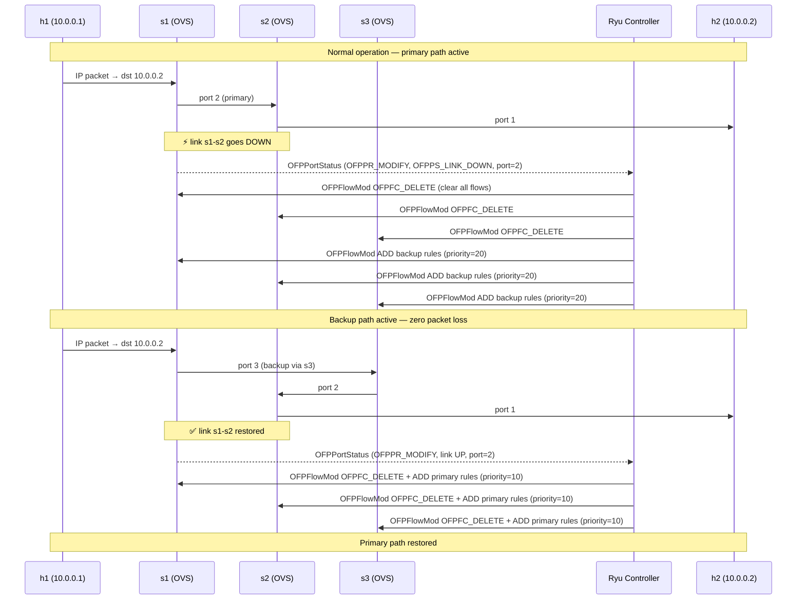
 
---
 
## 🧠 Controller Logic Deep Dive
 
### Event handlers
 
The controller registers two OpenFlow event handlers:
 
```python
@set_ev_cls(ofp_event.EventOFPSwitchFeatures, CONFIG_DISPATCHER)
def switch_features_handler(self, ev):
    # Fires when a switch first connects to the controller
    # Installs primary L3 flows + ARP flood rules on that switch
    datapath = ev.msg.datapath
    self.datapaths[datapath.id] = datapath
    self.install_primary_flows(datapath)
    self.install_arp_flows(datapath)
```
 
```python
@set_ev_cls(ofp_event.EventOFPPortStatus, MAIN_DISPATCHER)
def port_status_handler(self, ev):
    # Fires on every port state change across all connected switches
    # Monitors: dpid=1 (s1), port_no=2 (the s1-s2 link)
    #
    # OFPPS_LINK_DOWN → tear all flows, push backup (priority 20)
    # LINK_UP         → tear all flows, restore primary (priority 10)
```
 
### Flow rule priority table
 
| Layer | Match | Priority | Action |
|-------|-------|----------|--------|
| ARP flood | `eth_type=0x0806` | 5 | `FLOOD` — always on, survives path switches |
| Primary L3 | `eth_type=0x0800, ipv4_dst=10.0.0.x` | 10 | forward to specific port |
| Backup L3 | `eth_type=0x0800, ipv4_dst=10.0.0.x` | 20 | forward through s3 |
 
### Port mapping (per switch)
 
```
s1 (dpid=1):  port 1 → h1,  port 2 → s2,  port 3 → s3
s2 (dpid=2):  port 1 → s1,  port 2 → h2,  port 3 → s3
s3 (dpid=3):  port 1 → s1,  port 2 → s2
```
 
---
 
## 🛠 Setup & Installation
 
### Prerequisites
 
- Ubuntu 24.04 (native install — Mininet does not run correctly inside Docker or WSL)
- Python 3.11
- Mininet 2.3.0
- Ryu 4.34
### Installation
 
```bash
# Install Mininet
sudo apt install mininet -y
 
# Install Python 3.11
sudo add-apt-repository ppa:deadsnakes/ppa -y
sudo apt update
sudo apt install python3.11 python3.11-venv -y
 
# Set up Ryu in a virtual environment
python3.11 -m venv ~/ryu-env
source ~/ryu-env/bin/activate
pip install setuptools==58.0.0
pip install dnspython==2.3.0 eventlet==0.33.3
pip install ryu
 
# Install validation tools
sudo apt install wireshark iperf3 -y
```
 
> [!WARNING]
> Pin `eventlet==0.33.3` and `setuptools==58.0.0` exactly. Newer versions of either break Ryu's async event loop and cause silent startup failures with no helpful error message.
 
> [!NOTE]
> Always activate the virtual environment (`source ~/ryu-env/bin/activate`) before running `ryu-manager`. Running Ryu against the system Python will fail with import errors.
 
---
 
## 🚀 Running the Project
 
Open **two separate terminals**.
 
**Terminal 1 — Start the Ryu controller:**
 
```bash
source ~/ryu-env/bin/activate
ryu-manager controller.py
```
 
Wait until you see switch connection messages before proceeding to Terminal 2.
 
**Terminal 2 — Start the Mininet topology:**
 
```bash
sudo python3 topology.py
```
 
---
 
## 🎬 Demo Scenarios
 
### Scenario 1 — Baseline: normal operation
 
```bash
mininet> pingall
```
 
Expected: **0% packet loss**. Traffic flows `h1 → s1 → s2 → h2`.
 
### Scenario 2 — Link failure
 
```bash
mininet> link s1 s2 down
mininet> pingall
```
 
Expected: **0% packet loss**. Controller detects `OFPPS_LINK_DOWN` on s1 port 2, tears out all flow rules, and pushes backup rules through s3 before the next ping times out.
 
### Scenario 3 — Link recovery
 
```bash
mininet> link s1 s2 up
mininet> pingall
```
 
Expected: **0% packet loss**. Controller detects link restoration and switches back to the primary path.
 
### Scenario 4 — Sustained traffic during failure (iperf3)
 
```bash
# Start iperf3 server on h2
mininet> h2 iperf3 -s &
 
# Start 30-second stream from h1
mininet> h1 iperf3 -c 10.0.0.2 -t 30 &
 
# Trigger failure midway through
mininet> link s1 s2 down
 
# Watch iperf3 output — throughput should recover within one reporting interval
```
 
---
 
## 📋 Expected Output
 
**Controller terminal during failure detection:**
 
```
==================================================
LINK FAILURE DETECTED on s1-s2! Switching to backup path.
==================================================
ACTIVE PATH: h1 -> s1 -> s3 -> s2 -> h2 (Backup)
==================================================
```
 
**Controller terminal during link recovery:**
 
```
==================================================
LINK RESTORED on s1-s2! Switching back to primary path.
==================================================
ACTIVE PATH: h1 -> s1 -> s2 -> h2 (Primary)
==================================================
```
 
---

## Validation

- `pingall` confirms 0% packet loss before, during, and after link failure
- `ovs-ofctl dump-flows` confirms flow rule changes on each switch
- Wireshark captures confirm traffic path switching in real time
- iperf3 confirms throughput is maintained during rerouting

---

## Proof of Execution

### Network Startup — Primary Path Active
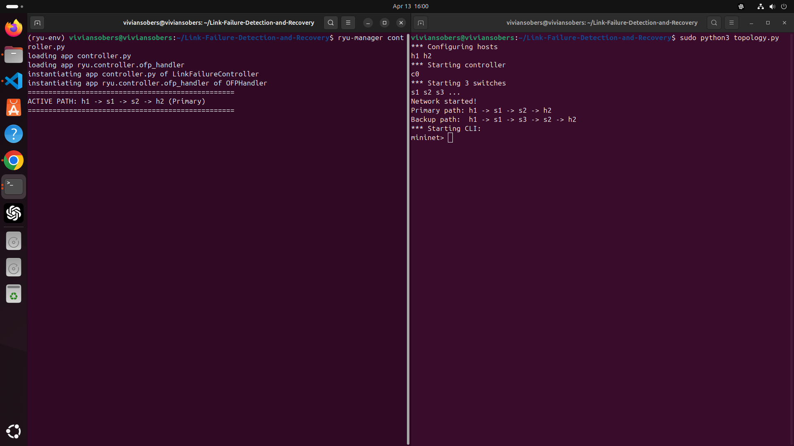

### Scenario 1 — Normal pingall (0% dropped)
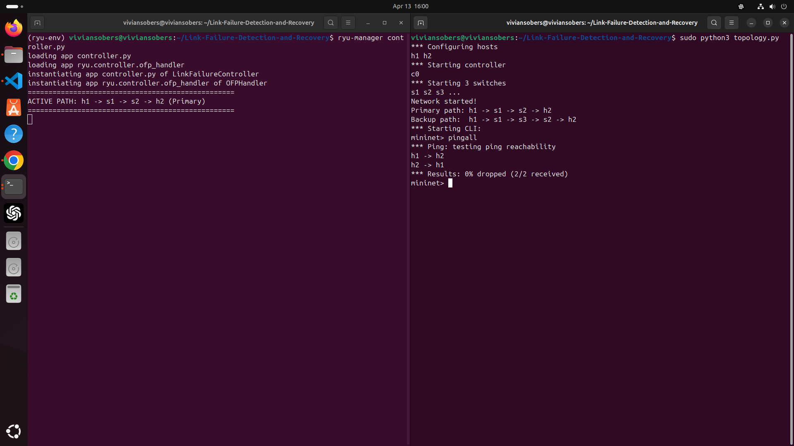

### Link Failure Detected — Switching to Backup Path
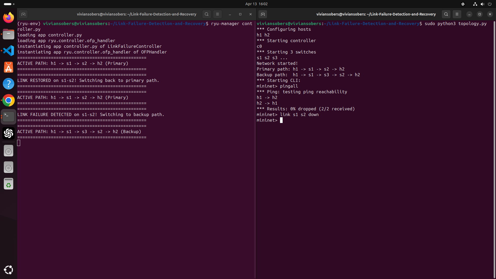

### Scenario 2 — pingall During Link Failure (0% dropped)
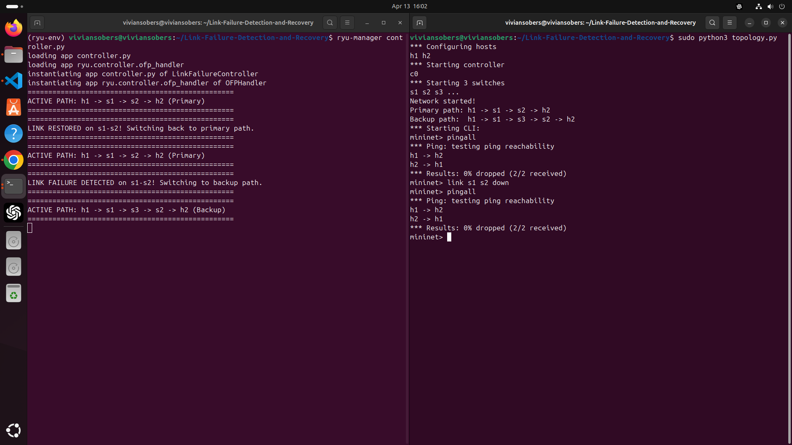

### Link Restored — Back to Primary Path
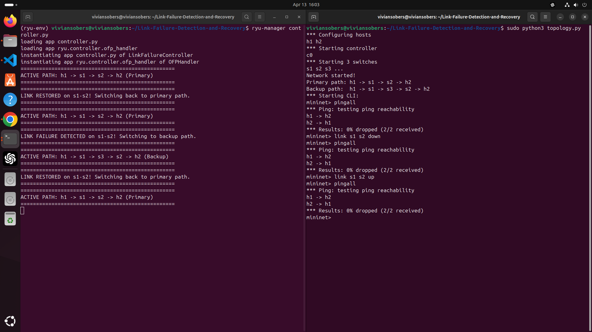

### iperf3 — Normal Operation (15.2 Gbits/sec)
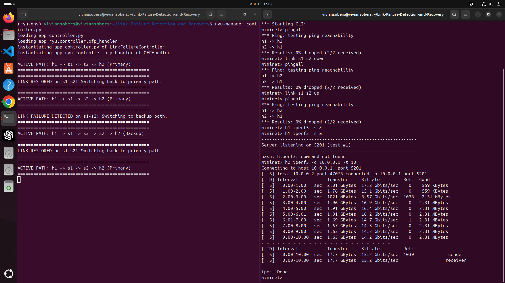

### iperf3 — During Link Failure (16.8 Gbits/sec)
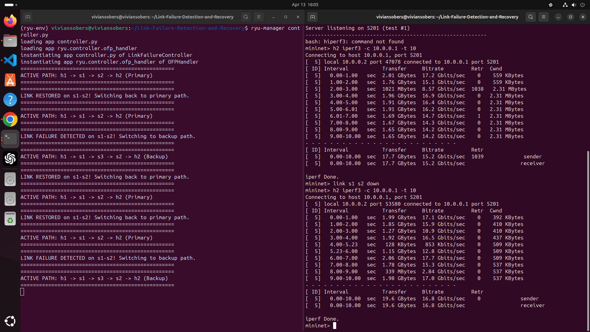

### Wireshark — ICMP Capture
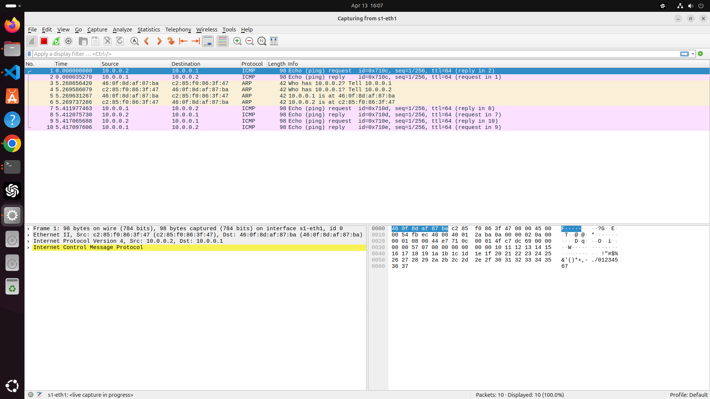

### Wireshark — ICMP Filtered (Normal)
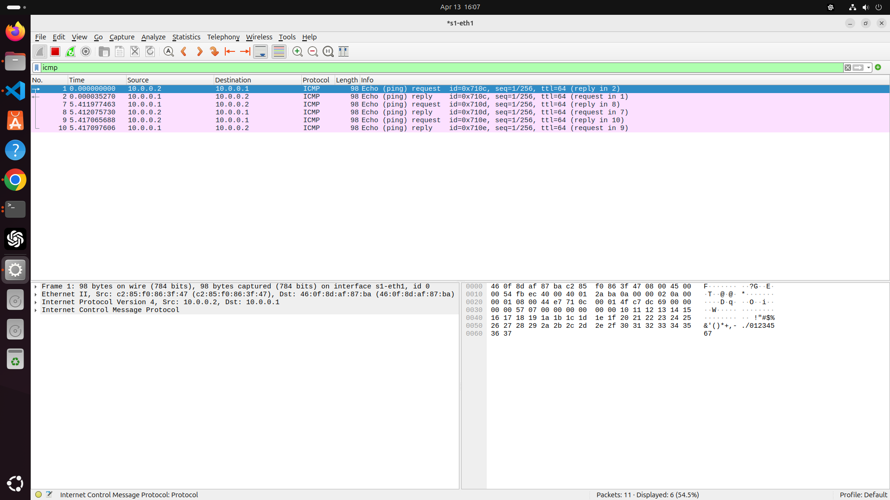

### Wireshark — ICMP Filtered (During Failure)
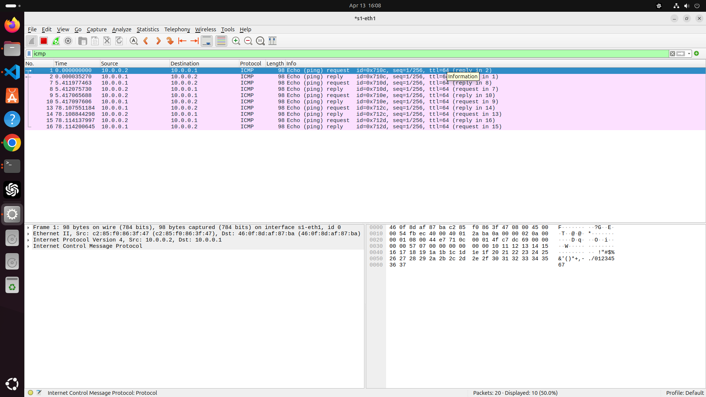

---
## Author

Vivian Sobers E
